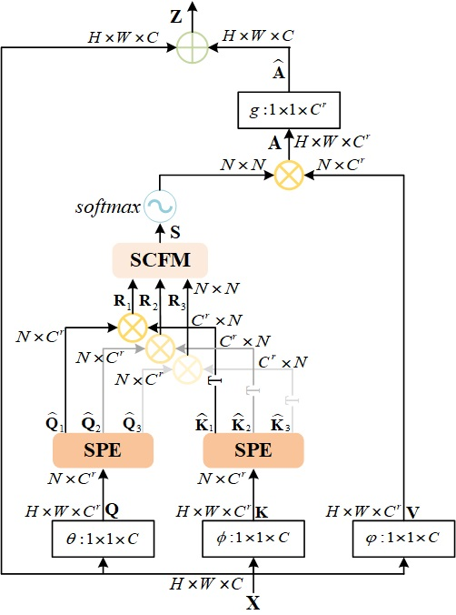
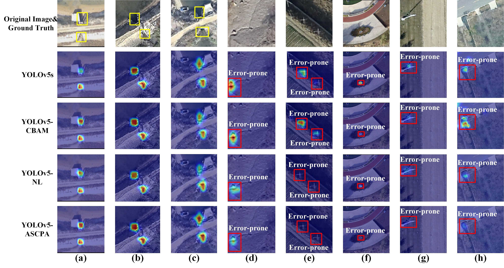

# ASCPA-Attention

## Introduction

This repository contains the official implementation of **Adaptive Spatial Correlation Pyramid Attention Network for Detecting Outfalls into Rivers and Oceans in Aerial Images**.

Adaptive Spatial Correlation Pyramid Attention (ASCPA). 

Strengthening the inspection of outfalls into rivers and oceans can help monitor pollutant emissions to the natural environment. Unmanned aerial vehicle (UAV) with high spatial resolution imagery has become a more efficient method for outfall surveys. At present, outfalls retrieval from UAV images relies on visual interpretation by skilled experts. However, long periods of concentration on detecting outfalls in high-resolution images for an expert easily increase mental load and stress, resulting in missing and false detection. Therefore, we develop a deep learning model (YOLOv5-ASCPA) based on You Only One Look 5th Version (YOLOv5) to perform outfalls detection in aerial images. In this model, an adaptive spatial correlation pyramid attention (ASCPA) network is proposed to establish long-distance region-to-region relationships between the outfall and its surrounding information more effectively. The proposed ASCPA network can be regarded as a module embedded into YOLOv5s architecture (Called YOLOv5-ASCPA). This network is mainly composed of SPE (Spatial Pyramid Extractor) and SCFM (Spatial Correlation Fusion Module). The purpose of the SPE is to extract multi-scale spatial information on the feature map. The SCFM is used to perform spatial correlation feature recalibration to selectively emphasized informative features. Experimental results demonstrate that the proposed network improves the performance of YOLOv5s in detecting outfalls by increasing Recall and AP0.5 from 86.5% to 89.1% and 83.1% to 86.5%, respectively. To show the superiority of the ASCPA network, we compared our results with other attention mechanisms and classic object detection models, all of them show that the ASCPA network has a competitive performance for outfalls detection. Moreover, based on visualization analysis, the ASCPA network is able to pay more attention on true outfall objects with respect to other attention mechanisms. These promising results demonstrate that the deep learning algorithm can be a feasible solution to assist experts in detecting outfalls with UAV imagery. 

## Result

Visualization results based on Gradcam. 

## Usage

ASCPA can be inserted into [YOLOv3](https://github.com/ultralytics/yolov3), [YOLOv4](https://github.com/Tianxiaomo/pytorch-YOLOv4) and [YOLOv5](https://github.com/ultralytics/yolov5/) as a standalone module.

The [configuration file](config/yolov5s.yaml) for YOLOv5 is provided here as an example.

## Summary & Prospect

Our team proposed ASCPA in order to promote the capability of YOLO series network for small object detection. ASCPA was tested on our outfall dataset and proved its excellent capability. Despite that ASCPA has not been tested in other datasets, we still hope that it will demonstrate his power in more datasets.

